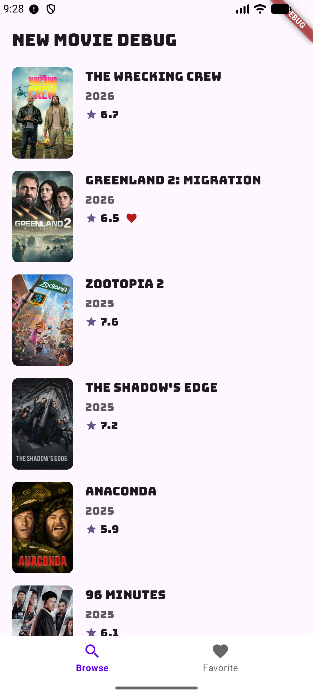
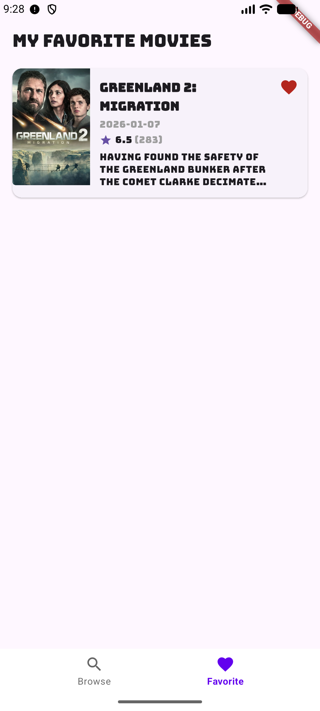
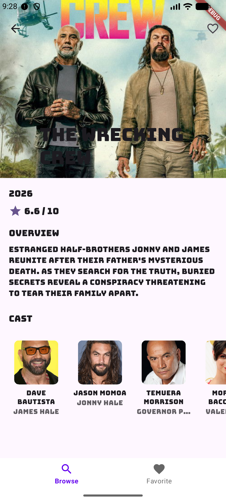
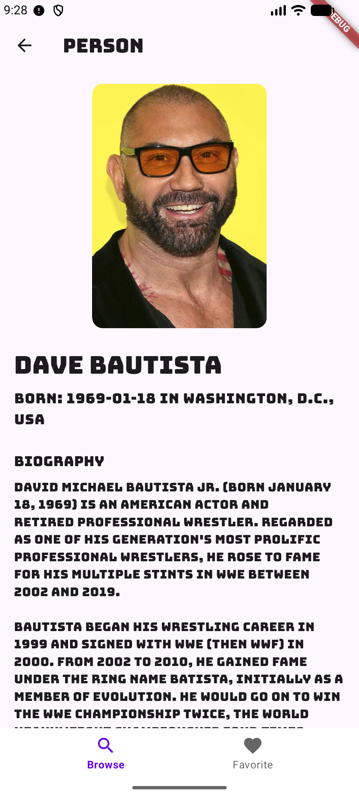

# Movie Android Super App

An Android super app that serves as a container for rendering Flutter modules and facilitating inter-module communication via method and event channels. This app is designed with minimal business logic, focusing solely on Flutter engine management and UI switching.

## Screenshots

|  |  |
|---|---|
|  |  |

## Overview

This super app acts as a **hosting platform** for multiple Flutter modules, providing:
- **Flutter Engine Management**: Creates, caches, and manages multiple Flutter engine instances
- **Inter-Module Communication**: Enables Flutter modules to communicate with each other and native Android via method channels and event channels
- **UI Navigation**: Provides the native Android UI layer for switching between Flutter modules/engines
- **Multi-Client Support**: All branding and configuration parameters are injectable at build time for Jenkins CI/CD pipelines

## Architecture

### Core Components

- **`FlutterEngineManager`**: Manages Flutter engine lifecycle, initialization, and caching
- **`MethodChannelRegistry`**: Registers method channels for bidirectional communication between Flutter modules and native Android
- **`EventChannelRegistry`**: Registers event channels for native-to-Flutter event streaming
- **`MainActivity`**: Hosts Flutter fragments and handles navigation between different Flutter modules
- **`ExtraActivity`**: Handles dynamic Flutter engine creation for additional screens (e.g., detail views)

### Key Principles

1. **No Business Logic**: This app contains **no business logic** except for:
   - Flutter engine creation and lifecycle management
   - UI for switching between Flutter engines/fragments
   - Channel registration and routing

2. **Module Communication**: Flutter modules communicate through:
   - **Method Channels**: Flutter → Native → Flutter (bidirectional)
   - **Event Channels**: Native → Flutter (one-way streaming)

3. **Branding Injection**: All branding parameters are configurable at build time:
   - App name, package ID, API endpoints
   - Image base URLs
   - Brand-specific resources (icons, colors, themes)

## Flutter Module Integration

### Engine Setup

The app initializes multiple Flutter engines on startup:

- **Browse Engine** (`browse_engine`): Main browsing module
- **Favorite Engine** (`favorite_engine`): Favorites module
- **Extra Engines**: Dynamically created for detail screens, modals, etc.

### Channel Communication

#### Method Channel
- **Name**: `com.movie.android/channel`
- **Purpose**: Flutter modules can call native methods and receive responses
- **Example**: Navigation requests from Flutter modules trigger native navigation

#### Event Channel
- **Name**: `com.movie.android/events`
- **Purpose**: Native Android can send events to Flutter modules
- **Example**: Notify favorite module when favorites are updated from browse module

### Adding a New Flutter Module

1. **Create Engine**: Add engine ID to `Constants.Engine`
2. **Register Channels**: Call `MethodChannelRegistry.register()` and `EventChannelRegistry.register()` for the new engine
3. **Create Fragment**: Add Flutter fragment in `MainActivity` or create new activity
4. **Update Navigation**: Add UI controls to switch to the new module

## Development

### Prerequisites

- Android Studio or IntelliJ IDEA
- JDK 11+
- Android SDK (API 24+)
- Flutter SDK (for Flutter module development)
- **Android Gradle Plugin (AGP) 9.0.0** — required for the project to build and run correctly


#### Local development (`local.properties`)

Copy `local.properties.example` to `local.properties` and set:
- `sdk.dir` — your Android SDK path (required)
- `APP_ID`, `APP_NAME`, `BASE_URL`, `IMAGE_BASE_URL` — optional overrides for local dev

Use the [brand repository](https://github.com/stableprinter/brand) to mock config values in `local.properties` for multi-client builds.

#### Brand-specific resources

Find resources in the [brand repository](https://github.com/stableprinter/brand) (icons, splash screen, fonts, etc.) to replace everything here for a realistic mock.

> **If changes to `local.properties` don't take effect**, run a clean build (`./gradlew clean build`) or use **File → Invalidate Caches** in Android Studio.

### Flutter Module Dependencies

Flutter modules are included as AAR artifacts. **Configure the Flutter AAR paths before building** — otherwise the build will fail. To edit the Flutter AAR paths:

#### 1. Edit AAR Dependency Coordinates

Edit the dependency declarations in **`app/build.gradle.kts`** (lines 84-86):

```kotlin
dependencies {
    // ...
    // Flutter engine from arr path (Flutter module built as AAR in arr/)
    debugImplementation("com.example.movie_core:flutter_debug:1.0")
    releaseImplementation("com.example.movie_core:flutter_release:1.0")
    add("profileImplementation", "com.example.movie_core:flutter_profile:1.0")
}
```

**Format**: `groupId:artifactId:version`
- `groupId`: Usually matches your Flutter core package (e.g., `com.example.movie_core`)
- `artifactId`: Flutter module name (e.g., `flutter_debug`, `flutter_release`, `flutter_profile`)
- `version`: Version number (e.g., `1.0`)

#### 2. Edit Maven Repository Path

Edit the Maven repository URL in **`settings.gradle.kts`** (lines 20-31):

```kotlin
maven {
    // Priority:
    // 1) CI env var (Jenkins)
    // 2) local dev override (optional)
    // 3) default relative path in a multi-repo workspace
    val repoPath =
        System.getenv("MOVIE_CORE_MAVEN_REPO")
            ?: System.getProperty("movieCoreMavenRepo")
            ?: "${rootDir}/../movie_core/build/host/outputs/repo"

    url = uri(repoPath)
}
```

**Configuration Priority**:
1. **Environment Variable** (`MOVIE_CORE_MAVEN_REPO`): Set in Jenkins CI/CD
2. **System Property** (`movieCoreMavenRepo`): Pass via `-DmovieCoreMavenRepo=/path/to/repo`
3. **Default Path**: Relative path `../movie_core/build/host/outputs/repo`

**For Local Development**:
- Build Flutter AAR: `cd arr && flutter build aar`
- The AAR will be generated in `arr/build/host/outputs/repo/`
- Update the default path in `settings.gradle.kts` to point to your Flutter module's build output

**For Jenkins CI/CD**:
- Set `MOVIE_CORE_MAVEN_REPO` environment variable to the path where Flutter AARs are published

### Building

```bash
# Debug build
./gradlew assembleDebug

# Release build
./gradlew assembleRelease

# With custom branding (for Jenkins)
./gradlew assembleRelease \
  -PAPP_ID=com.client.movie \
  -PAPP_NAME="Client App" \
  -PBASE_URL=https://api.client.com/v1 \
  -PIMAGE_BASE_URL=https://cdn.client.com
```
